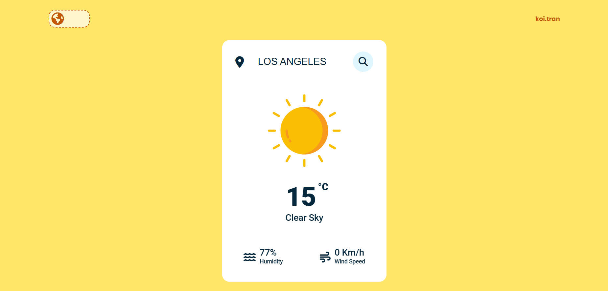

# The Weather Announcement Website

#### _Author: Tran Ngoc Dang Khoi_


#

This is a personal project that I developed to announce the current state of weather by fetching data from the OpenWeatherMap.org API based on user-specified locations.

## Purpose

1. Gain a deeper understanding of HTML, CSS, and JavaScript in web development.
2. Learn how to integrate data collection from APIs or other data provider platforms.
3. Personal development and learning experience.

## Technique

- Language: `HTML`, `CSS`, `JavaScript`.
- IDE: `VsCode`.
- Database: [OpenWeatherMap.org](https://openweathermap.org/)
## Methodology

### About the Technique

In addition to standard website-processing techniques, I integrate data from the OpenWeatherMap.org database by obtaining an API Key from their website. I then learn the API documentation to understand the syntax in JavaScript and JSON and how to retrieve the required data for displaying on the website.

### About the OpenWeatherMap.org Database

Write a brief introduction about the OpenWeatherMap.org website and provide more details about the current weather section.

## User Manual

### ✨ Step 1: Clone the Repository

Follow these instructions to clone the repository on GitHub:

```
git clone <repository_url>
```

### ✨ Step 2: Get the API Key from OpenWeatherMap.org

To obtain the API Key, sign up on the OpenWeatherMap.org website and navigate to your profile page. In the header section, click on the 'API Key' section to access your API Key.

### ✨ Step 3: Replace the API Key in the 'script.js' file

Open the 'script.js' file and replace the placeholder API Key with the one obtained from OpenWeatherMap.org. Save the file and enjoy using the website!

## Result

The website successfully retrieves data from the OpenWeatherMap.org weather database and displays it for the selected location. Moreover, it provides an opportunity to learn and practice HTML, CSS, and JavaScript, enhancing skills in both front-end design and back-end processes.

## Limitations

- The website is currently simple and heavily relies on the API key, which may complicate the user's experience.
- It lacks sufficient data for users to access detailed statistics and weather forecasts, which are commonly desired on weather websites.
- Upgrading the website requires more time and advanced skills.

## Future Updates

In future updates, I plan to include the following enhancements:

- Detailed weather forecasts for the user's selected location, with data visualization and timely updates.
- Support for the Vietnamese language as an additional feature of the website.

I hope to implement these updates in the near future.

## References

### Tutorials

- [How To Make Weather App Using JavaScript Step By Step Explained - GreatStack](https://www.greatstack.io/how-to-make-weather-app-using-javascript/): very first inspiring idea for me to create a website that provides for daily life.
- [Weather Application Programming – HoleTex](https://holetex.com/weather-application-programming/): provides standard knowledge from applying API and data of OpenWeatherMap for the Weather Website.

### Documentation

- [w3schools.com](https://www.w3schools.com/): Provides standard syntax and programming guides for HTML, CSS, and JavaScript.
- [OpenWeatherMap.org](https://openweathermap.org/): Website with a comprehensive database and guides, mainly supporting this project.

Thank you for reading!
